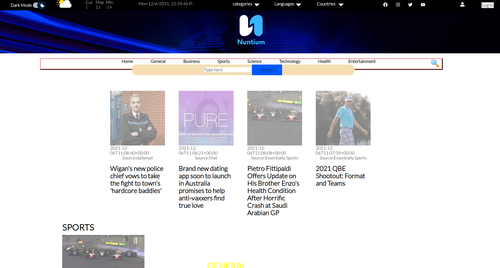
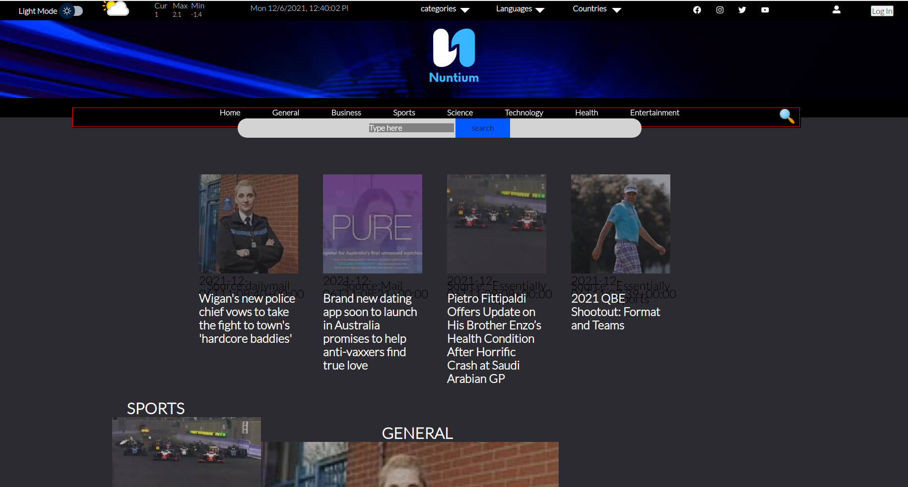
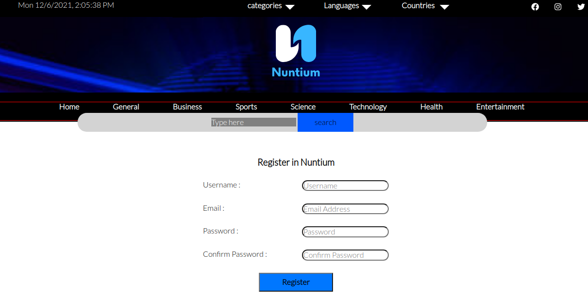
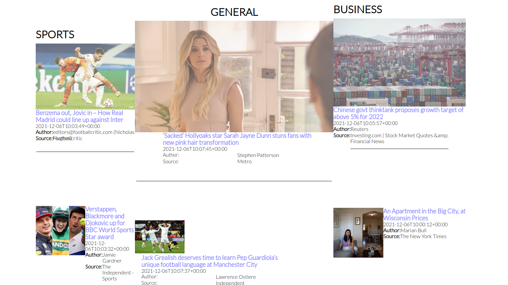

# Nuntium (News Website)

Nuntium is News Website Project have a unified interface on one platform to read everything. and also user can choose which category or language or country so he can browse only what he chooses.

Nuntium is a MERN full Stack News Website that helps you:

- Read news from different resources.
- Select news by Category or Language or Country.
- Resources of 10 Languages and 12 Countries.
- User can interact with Articles and comments (in progess).

## **Tech**

======

We used number of different technologies

- Node.js
- Express
- MongoDB
- mongoose
- JWT
- ReactJS
- axios
- SASS
- React-Hook-Form
- react-icons
- and so on

## **Future Plan**

- Video news
- Printable PDF (NEWS Magazin)
- React Native to make a mobile app
- Web Admin can add Articles
- Login by Social media
- Make a Newsletter

## **TEAM Member**

- [ Ahmad Nabbaa / focus on FrontEnd ](https://github.com/anabbaa)
- [ Omar Khouja / focus on BackEnd ](https://github.com/okhouja)
