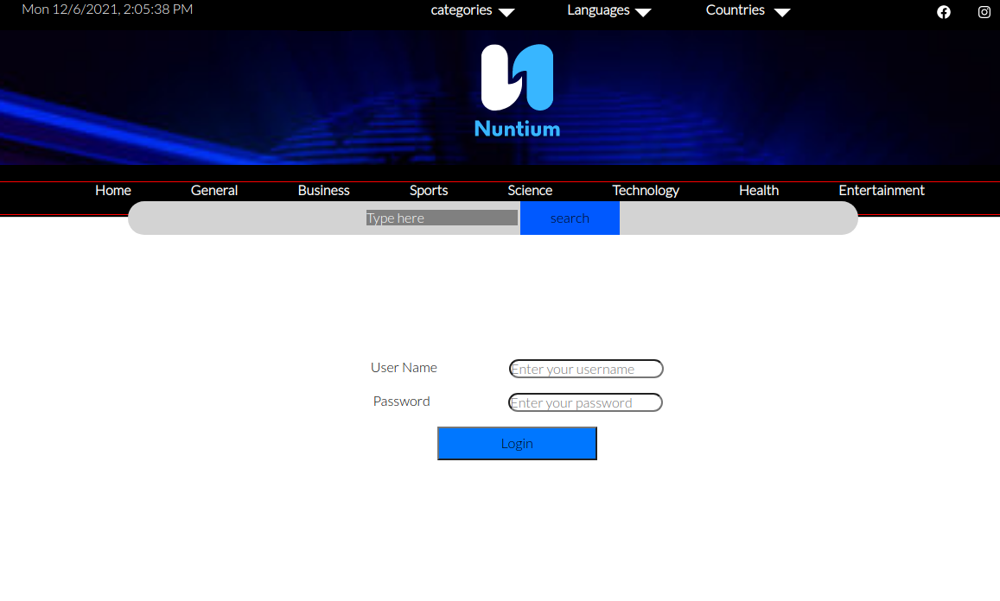

# Nuntium (News Website)

Nuntium is News Website Project have a unified interface on one platform to read everything. and also user can choose which category or language or country so he can browse only what he chooses.

Nuntium is a MERN full Stack News Website that helps you:

- Read news from different resources.
- Select news by Category or Language or Country.
- Resources of 10 Languages and 12 Countries.
- User can interact with Articles and comments (in progess).

## **Tech**

======

We used number of different technologies

- Node.js
- Express
- MongoDB
- mongoose
- JWT
- ReactJS
- axios
- SASS
- React-Hook-Form
- react-icons
- and so on

